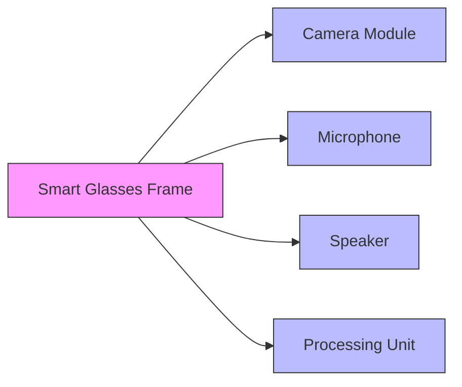
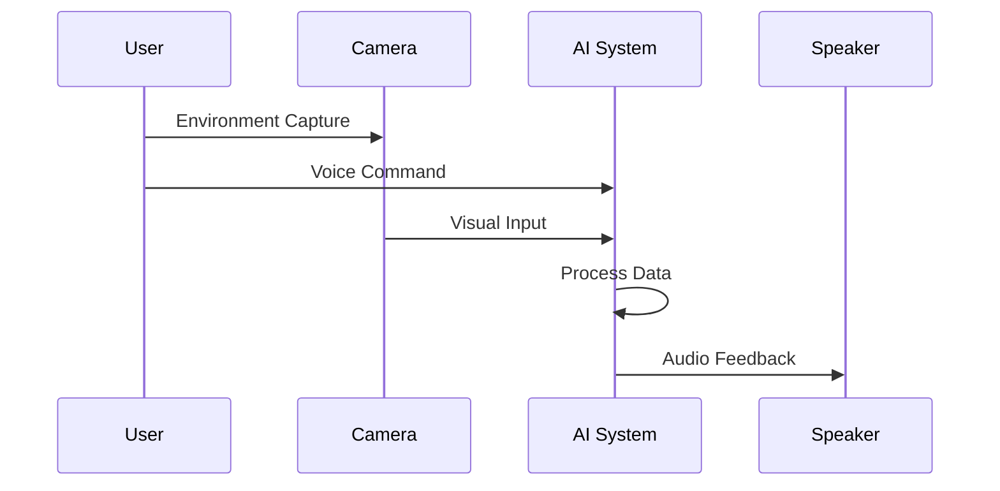

# 🥽 AI-Powered Navigation Glasses
> Empowering visually impaired individuals with AI-driven navigation assistance


## 🎯 Project Overview
The AI-Powered Navigation Glasses aim to empower visually impaired individuals to navigate their surroundings more effectively. Using a combination of AI, computer vision, and real-time audio feedback, the glasses will assist users in identifying objects, understanding environments, and making informed decisions.

### ✨ Key Features
- 📸 **Camera Integration**
  - Captures the user's environment in real-time
  - High-definition visual processing
  
- 🤖 **AI-Powered Object Detection**
  - Identifies objects and their locations
  - Uses advanced machine learning models
  
- 🗣️ **Interactive Voice Assistant**
  - Natural language processing
  - Seamless voice command interface
  
- ⚡ **Real-Time Feedback**
  - Instant auditory descriptions
  - Precise directional guidance

## 🎯 Objectives
- 🌟 Enhance independence and quality of life for visually impaired individuals
- 🤝 Leverage open-source collaboration to improve the system
- 💡 Create a cost-effective and scalable solution for global adoption

## 🏗️ System Architecture

### Hardware Components


### 💻 Software Components
- **Object Detection Model**
  - YOLO
  - Faster R-CNN
  - Custom ML models
- **Voice Interaction System**
  - NLP integration
  - Speech-to-text
  - Text-to-speech
- **Edge Computing**
  - Real-time processing
  - Cloud integration options

## ⚙️ Functional Workflow



## 📅 Development Plan

### 🔍 Phase 1: Research & Planning
- [ ] User research with visually impaired individuals
- [ ] Technology evaluation
- [ ] Requirements gathering

### 🛠️ Phase 2: Prototyping
- [ ] Basic prototype development
- [ ] Core feature implementation
- [ ] Initial testing

### 🧪 Phase 3: Testing
- [ ] User testing sessions
- [ ] Performance optimization
- [ ] Feedback integration

### 🚀 Phase 4: Deployment
- [ ] Open source release
- [ ] Community building
- [ ] Documentation

## 🤝 Open Source Contribution

### Repository Structure
```
/
├── src/               # Source code
├── hardware/          # Hardware specs
├── docs/             # Documentation
├── tests/            # Testing scripts
└── README.md         # Project info
```

### 📋 Guidelines
- Detailed setup instructions
- Clear contribution guidelines
- Community code of conduct

## 🚧 Potential Challenges
| Challenge | Impact | Mitigation |
|-----------|--------|------------|
| Latency | High | Edge computing optimization |
| Cost | Medium | Open source components |
| Privacy | High | Local processing |

## 🔮 Future Directions
1. 📈 Expanded object detection
2. 📝 OCR integration
3. 🌍 Global distribution

## 📞 Contact & Support
- **GitHub:** [[Repository Link]](https://github.com/SaifeddineDouidy/AI_Navigation)
- **Email:** douidysaifeddine@gmail.com & aya.sadoq.2003.lm@gmail.com

---
<div align="center">
Made with ❤️ for accessibility
</div>
